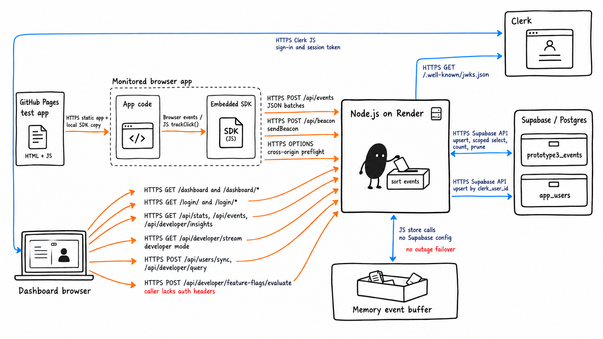
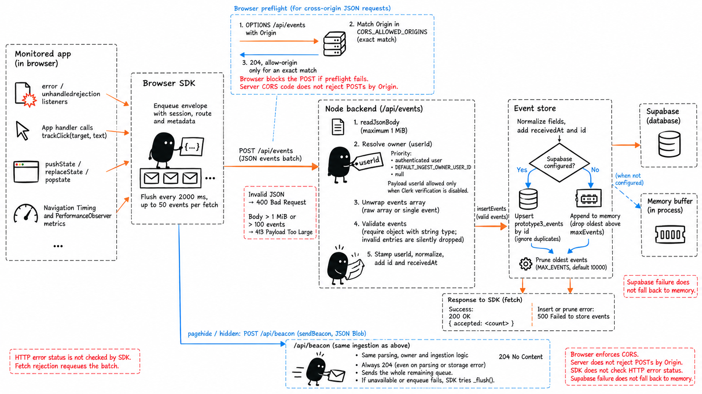
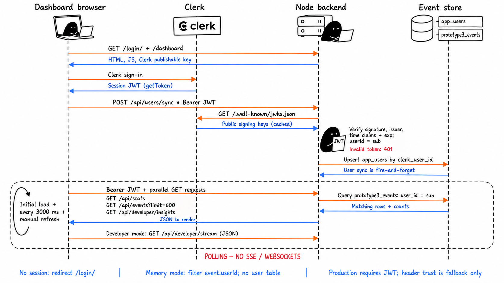
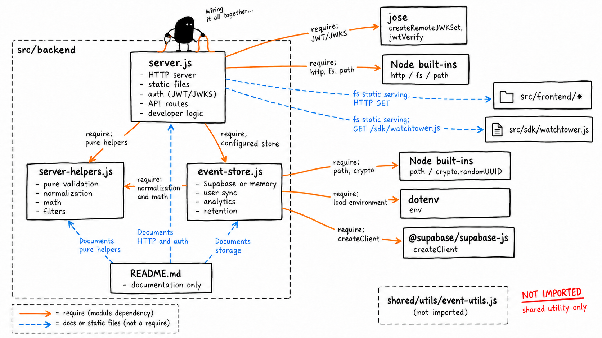

# WatchTower architecture illustrations

Four hand-drawn image adaptations of [the verified Mermaid diagrams](../../docs/architecture/diagrams.md), created with the Ian Xiaohei illustration skill and the built-in image generator. The Mermaid document retains the full conditions, source references, and documentation discrepancies.

## System architecture

## Event ingestion

## Dashboard auth and polling

## Backend module map

Generated prompts and revision instructions are recorded in [prompts.md](prompts.md).
