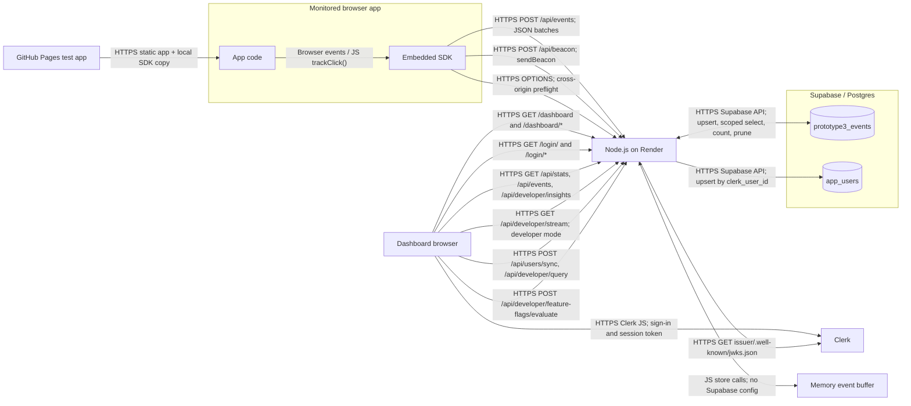
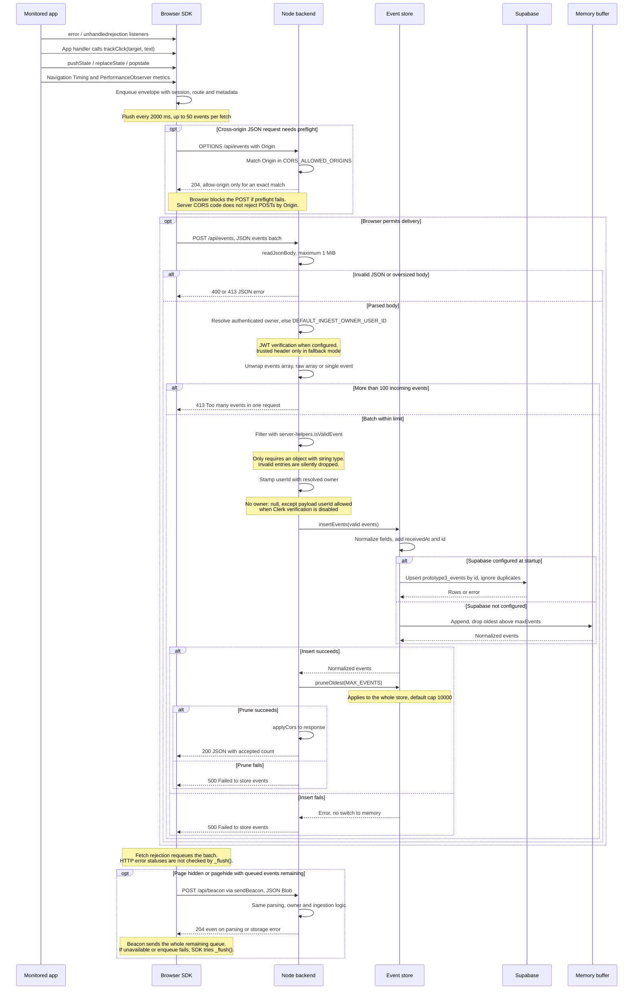
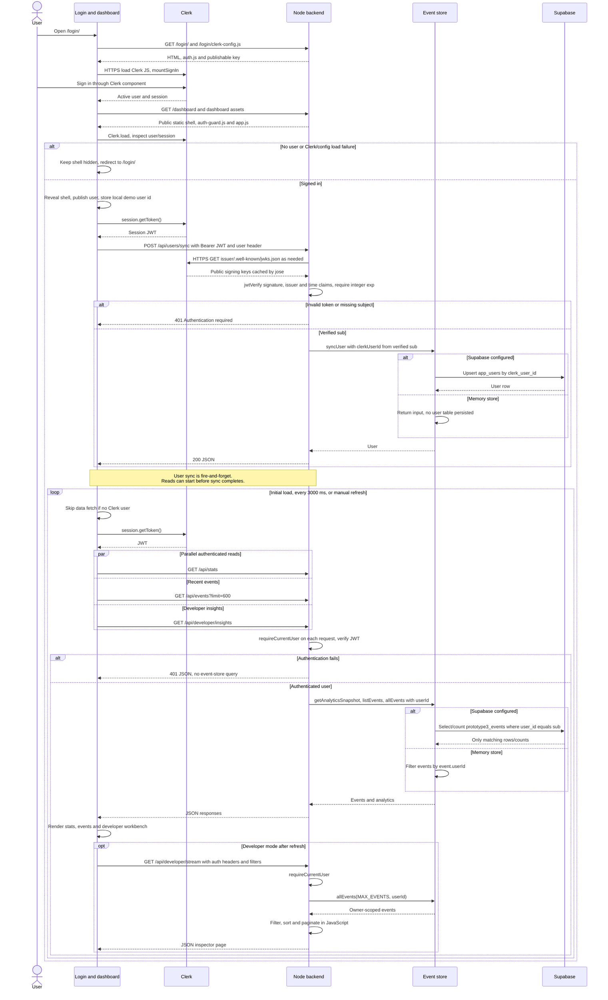
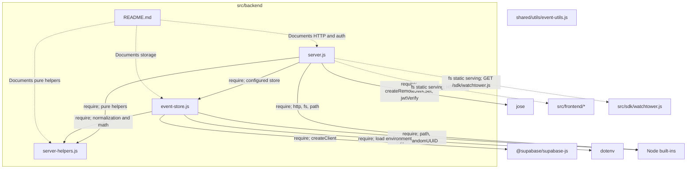

# Architecture and workflow diagrams

These diagrams describe the active implementation in `src/`. Code takes precedence over existing documentation. Node labels are kept short; edge labels carry the protocols, endpoints, and calls.

Primary sources: [server.js](../../src/backend/server.js), [server-helpers.js](../../src/backend/server-helpers.js), [event-store.js](../../src/backend/event-store.js), [watchtower.js](../../src/sdk/watchtower.js), [event-utils.js](../../src/shared/utils/event-utils.js), [auth.js](../../src/frontend/auth/auth.js), [auth-guard.js](../../src/frontend/dashboard/auth-guard.js), [dashboard app.js](../../src/frontend/dashboard/app.js), and [demo app.js](../../src/frontend/demo/app.js).

Deployment labels (Render and the separate GitHub Pages test app) come from [README.md](../../README.md) and [auth-workflow.md](auth-workflow.md). The external test app's source and deployed environment are outside this checkout; its configured endpoint is documented, not independently verified here. No unimplemented project-key service or additional database table is assumed.

## 1. System architecture

- The Node server serves the frontend and `/sdk/watchtower.js`. Its `/demo/` page is an in-repo monitored app; `/dashboard-demo/` is a static preview. The external Pages app is a separate documented consumer of the same ingestion API.
- The dashboard reads backend JSON; it does not subscribe directly to Supabase. HTTPS denotes the documented hosted deployment; the Node listener itself is plain `http.createServer` and local development uses HTTP.
- Table names above are defaults. `SUPABASE_P3_EVENTS_TABLE` and `SUPABASE_P3_USERS_TABLE` can override them. The server selects Supabase when `SUPABASE_URL` and either `SUPABASE_SERVICE_ROLE_KEY` or `SUPABASE_ANON_KEY` exist, preferring the service-role key. Otherwise it selects memory at startup. A Supabase failure does not switch storage to memory.
- The feature-flag evaluation endpoint exists and requires authentication, but its current dashboard caller omits auth headers; see the discrepancies below.

## 2. Event ingestion

Capture details are from `watchtower.js`: errors are automatic; clicks require explicit `trackClick()` calls (wired in `demo/app.js`); route tracking wraps history changes and listens for `popstate`; performance capture includes `pageload` plus LCP, CLS, and INP-labelled observer samples when supported. These are the implementation's samples, not a claim of full Web Vitals aggregation.

Owner precedence is authenticated user, then `DEFAULT_INGEST_OWNER_USER_ID`, then the local payload-owner exception, then `null`. With verification enabled, client payload ownership is overwritten even when no default exists. With verification disabled, the listener binds to `127.0.0.1` and payload `userId` can be retained. The SDK itself sends no Clerk token or user header.

CORS is response-header logic: `*` is excluded from the configured allowlist, and absent/disallowed origins get no `Access-Control-Allow-Origin`. Same-origin browser calls do not need CORS permission. Direct HTTP clients can still POST; there is no server-side origin-denial branch. `/api/beacon` has the same cross-origin considerations and the same 100-event limit, even though the SDK's beacon flush can exceed it.

## 3. Dashboard auth and data read

The sequence shows normal Clerk verification. `getClerkUserHeaders()` also sends `X-Clerk-User-Id`; it is ignored unless verification is disabled or `WATCHTOWER_TRUST_USER_HEADER=true`. Production startup rejects disabled verification and rejects header trust. In non-production, explicitly enabling header trust with verification configured still binds to `0.0.0.0`; it is not inherently loopback-only.

**Updates are HTTP polling, not SSE or websockets.** `POLL_INTERVAL = 3000` drives `fetchDashboardStats()`. Each refresh fetches stats, 600 recent events, and developer insights concurrently; developer mode additionally fetches a JSON inspector page. `/api/developer/stream` is a paginated JSON endpoint, and there is no active `/api/events/stream` route, `EventSource`, WebSocket client, or WebSocket server in these sources. SDK delivery independently runs every 2000 ms.

The query workbench uses authenticated `POST /api/developer/query`: the backend loads owner-scoped events and evaluates its restricted SQL-like syntax in JavaScript, not against a separate SQL table. User sync is not required to establish event ownership; the verified subject supplies the filter directly.

## 4. Backend module map

Solid arrows indicate imports; dashed arrows identify static resources or documentation relationships. Every file currently under `src/backend/` appears below.

| Backend file | Responsibilities |
| --- | --- |
| `server.js` | Starts plain Node HTTP; serves static frontend/SDK files; applies CORS and response headers; parses and limits bodies; verifies Clerk JWTs; resolves ingest owners; routes event ingestion and scoped reads; syncs users; builds developer insights; evaluates SQL-like queries and feature flags. Query rate limits are in-memory. |
| `server-helpers.js` | Dependency-free functions for permissive event validation, normalization, numeric summaries, timestamps, environment/name derivation, inspector filters/pagination, recent events and concurrency counts. Imported by both runtime modules. |
| `event-store.js` | Loads dotenv configuration; selects Supabase or memory; normalizes events and assigns IDs; maps camelCase events to snake_case rows; inserts/lists/counts/prunes events; syncs users; computes analytics snapshots. Exports schema/migration SQL strings but does not execute migrations. |
| `README.md` | Describes the three JavaScript modules and links configuration/API documentation. No runtime dependency. |

The isolated `shared/utils/event-utils.js` node is intentional: none of the active backend modules imports it. Its stricter validator is not on the ingestion path. The SDK and frontend are served as files, not imported into the server process. Memory storage and Supabase access both live in `event-store.js`; there are no separate controller, auth, CORS, queue, or database modules to add to this map.

## Documentation/code discrepancies

| Documentation or assumption | Verified implementation |
| --- | --- |
| Root README calls the dashboard "real-time" and describes streaming. Historical [API v1](api-contract-v1.md) describes SSE broadcasts. | Current `dashboard/app.js` polls every **3000 ms**; SDK delivery runs every **2000 ms**. The v1 SSE endpoint is retired, as the v1 banner and later auth documentation correctly acknowledge. The current developer "stream" returns JSON. |
| [auth-workflow.md](auth-workflow.md), page responsibilities and user recognition, emphasizes `X-Clerk-User-Id` as the scoping mechanism. | Both auth-guard and normal dashboard reads attempt to send a Bearer JWT plus the header. With verification enforced, the JWT's verified `sub` controls ownership. The later trust-model section is closer to the code. |
| [API v2](api-contract-v2.md) says header-trust mode binds only to loopback. | Binding depends on `CLERK_VERIFICATION_ENABLED`, not the trust flag. No verification means `127.0.0.1`; verification plus explicit header trust in non-production means `0.0.0.0`. Production rejects header trust. |
| [Shared utilities README](../../src/shared/utils/README.md) calls `event-utils.js` the canonical implementation used by the backend. [Event schema v1](event-schema-v1.md) says the server stores events without revalidation. | Active ingestion filters using `server-helpers.isValidEvent`: object plus string `type` only, even an empty string. The unimported shared validator instead requires a nonempty type, parseable timestamp, and object data. Missing fields are normalized later; invalid nonempty timestamps are not repaired. |
| [API v2](api-contract-v2.md) says all JSON endpoints send CORS headers; README says unset CORS allows only same-origin requests. | Allowed methods/headers are emitted, but allow-origin appears only for an exact configured origin. There is no Origin rejection in ingestion. Browser CORS enforcement and server authorization are distinct. |
| [Event schema v2](event-schema-v2.md) presents snake_case fields and says browser/API payloads "may use" camelCase. | Ingestion normalization reads camelCase metadata (`userId`, `sessionId`, `eventName`, etc.). Snake_case names describe database rows; there is no general snake_case input adapter. `user_id` in a payload does not assign an owner. |
| [API v2](api-contract-v2.md) shows `eventsByType`, `averageLatency`, and an `analytics` object in `/api/stats`. | The configured stores implement `getAnalyticsSnapshot()`, returning `eventBreakdown`, `feedbackCounts`, `featureCounts`, `userActivity`, `analyticsRanges`, and `maxUsers` alongside totals and recent events. The documented example is not the actual current response shape. |
| Auth workflow user-sync examples omit timezone; a source comment says sync ensures the user row exists before reads. | `auth-guard.js` sends the stored timezone, and the store writes `timezone` plus `last_seen_at`. Sync is fire-and-forget and reads wait for Clerk user availability, not completion of the upsert. |
| Auth workflow ends its configuration section by referring to backend verification being added later. Its opening logout sketch returns to the landing page. | Verification already exists through `jose` and public JWKS, requiring no Clerk secret. Both dashboard sign-out controls redirect to `/login/`, consistent with the document's later logout section. |
| [API v2](api-contract-v2.md) presents feature-flag evaluation as a working dashboard call and illustrates `flags` as an object. | The server requires an authenticated user and returns a flags array. The button handler currently sends only `Content-Type`, so that call gets 401 against the active backend; it does not use the normal auth-header helper. |
| Root README says threshold-based email alerting exists today. | Active backend files contain no email transport or sending route. Dashboard notification settings and alert indicators exist; an email-delivery component cannot be substantiated from this implementation and is omitted. |
| A reader could interpret the storage "fallback" as database-outage failover or assume SDK retries every failed HTTP response. | Store selection occurs at startup based on configuration. Supabase insert/prune errors return 500 for `/api/events`; beacon errors are swallowed with 204. SDK `_flush()` retries rejected fetch promises but never checks `response.ok`, so HTTP 400/413/500 responses are treated as delivery success. |

Path clarification: the requested `src/shared/event-utils.js` does not exist; the file reviewed is `src/shared/utils/event-utils.js`. Historical v1 contracts and the original external-app separation plan are not treated as active architecture; the plan's Prototype 3 addendum records the later external deployment.
